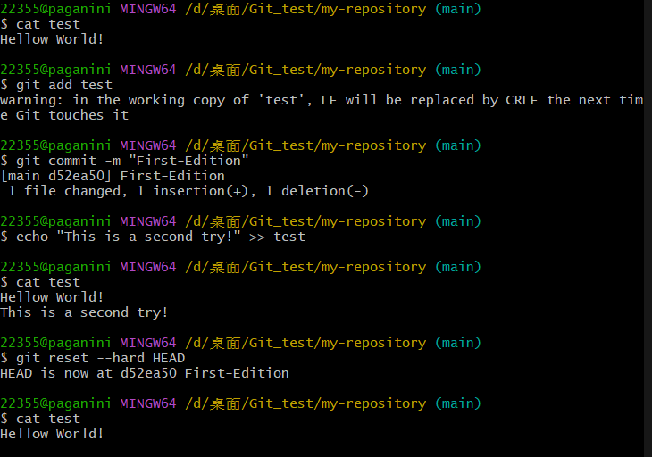
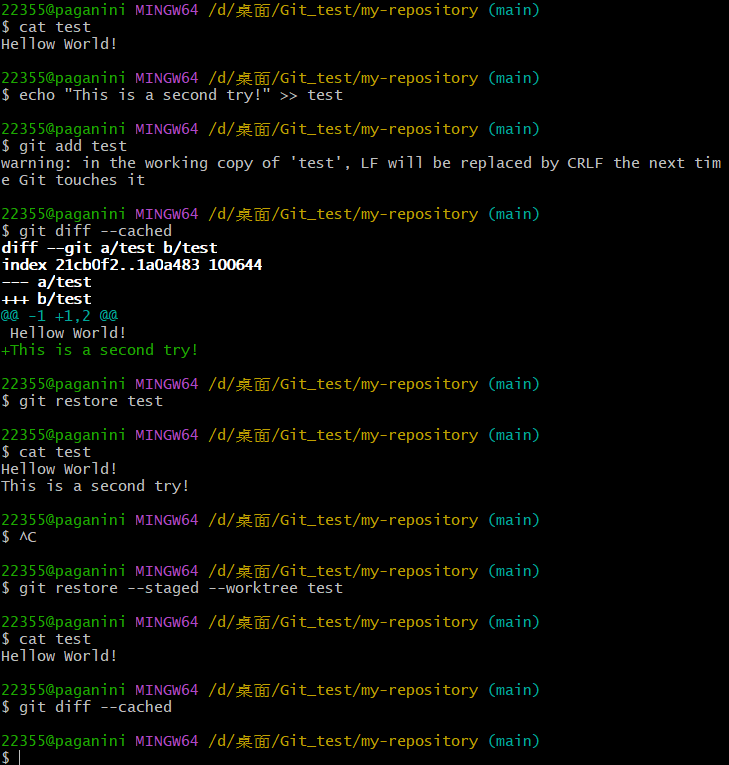
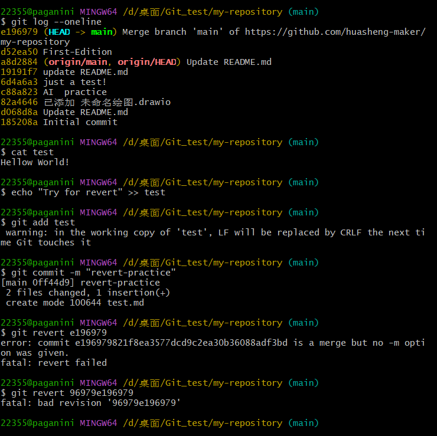
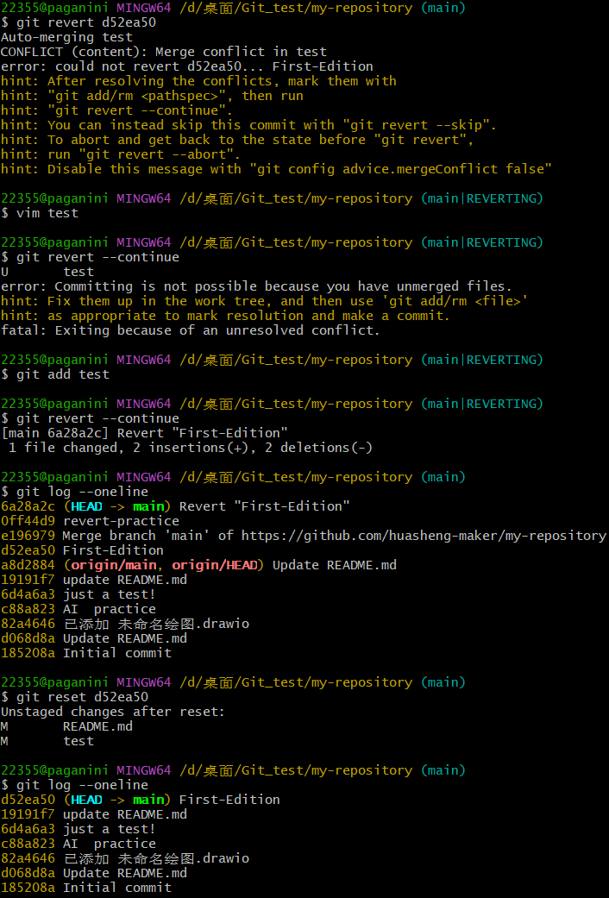

# Git的版本管理

---

## 问题背景：
1. 若你已经修改了部分文件、并且将其中的一部分加入了暂存区，应该如何回退这些修改，恢复到修改前最后一次提交的状态？给出至少两种不同的方式
2. 若你已经提交了一个新版本，需要回退该版本，应该如何操作？分别给出不修改历史或修改历史的至少两种不同的方式

### 问题一
#### reset
* 本质上是移动头指针到指定版本，--hard需要慎用，回清除之前的提交信息。
* `git reset <上一次提交的版本>`这是清除工作区和暂存区内容，回退到上一次提交状态的reset方法。

#### restore
* 这个`git restore file`只能清除工作区的修改，如果已经add的话这个指令失效。若要同时清除工作区和暂存区的修改，
 使用`git restore --cached --worktree <file>`。

---

### 问题四
#### reset

#### revert(不删除提交信息)
* 它的思想是多加一个commit来修改之前的一个版本.
